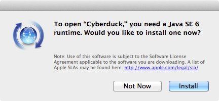

## Introduction

This is a Python script that uses the private SoftwareUpdate framework to download packages from Apple's Software Update servers using a predicate.

Predicates allow you to specify non-update packages you want to install.
This mechanism is used e.g. by the Add Printer window to download a specific printer driver and the Speech prefpane to download voices for the language you selected.
They write the predicate to a plist file (examples: [Java](docs/SUO_Java.plist), [voices](docs/SUO_Voices.plist), [printer drivers](docs/SUO_Printer_Drivers.plist)) and call Software Update.app with the `-PredicateOptions` flag:

	/System/Library/CoreServices/Software Update.app/Contents/MacOS/Software Update -PredicateOptions /var/folders/zr/zr7jmShWFHKCpwZ-u+Y8rU+++X2/-Tmp-/SoftwareUpdateOptions.plist

This shows a window like this one:

In Mac OS X 10.6 Snow Leopard, the command line equivalent /usr/sbin/softwareupdate used to have an option `--predicate` that mimicked this behavior:

	sudo softwareupdate --predicate ~/Desktop/SoftwareUpdateOptions.plist --list
	sudo softwareupdate --predicate ~/Desktop/SoftwareUpdateOptions.plist --install --all

In Mac OS X 10.8 Mountain Lion however, that flag no longer exists. This script is supposed to fill that void.

I have tested this script on Mac OS X 10.6.8 through macOS 10.13.

## Example

Here is an example of how to call it:

	sudo python predicate_installer.py '"VOICEID:com.apple.speech.synthesis.voice.anna.premium_2" IN tags OR "VOICEID:com.apple.speech.synthesis.voice.steffi.premium_2" IN tags OR "VOICEID:com.apple.speech.synthesis.voice.yannick.premium_2" IN tags'

If you'd like to see what it outputs, have a look [here](docs/log.txt) (it follows /var/log/install.log to show you what it's doing). Don't worry if it pauses for a few seconds or minutes after outputting _Acquired Lock: 0, 3887, 0_: it's simply downloading the package and doesn't have any kind of progress indicator.

I have collected a number of working [examples](examples).

## Installer Predicates

To figure out what predicate you need to install a certain printer driver, voice, Java installer, etc., simply trigger the install in the GUI (i.e. select the driver in the Add Printer window, choose the voice in the Speech prefpane or launch a Java app, ...) so you get a window like the one shown above and then open a Terminal to run

	ps axu | grep 'Software Update'

This will give you a line like 

	/System/Library/CoreServices/Software Update.app/Contents/MacOS/Software Update -PredicateOptions /var/folders/c2/6n0g8_9n0gxbj_xsdt1byn600000gp/T/SoftwareUpdateOptions.plist

In some cases, the window might not appear like the one shown above but rather as a sheet of the current window (Add Printer appears to be doing just that). In this case, actually start the install (you can still cancel it while it downloads) and have a look at /var/log/install.log where you can find lines like

	Mar 16 12:29:59 testclient.physcip.uni-stuttgart.de Software Update[4218]: SoftwareUpdate: Using predicate ("printing software" IN tags OR "printer update" IN tags) AND "MANUFACTURER:HP;MODEL:Color LaserJet CP4020-CP4520" IN tags
	Mar 16 12:29:59 testclient.physcip.uni-stuttgart.de Software Update[4218]: SoftwareUpdate: Using filter keys 041-9116

The plist file matches the ones linked above and contains a key `predicate`, which you can use (note that in some cases you might need to unescape it).

### Additional dependencies

Note that some installers require certain environment variables to be set even when using a predicate.
For example, [Java needs JAVA_INSTALL_ON_DEMAND](examples/install_java.py).

Similarly, printer drivers require the printer to already be connected to the computer or visible on the network. As this is determined by looking at /Library/Printers/InstalledPrinters.plist, this check is [easy to bypass](examples/install_printers.py).

If you can't figure out what variable to set or file to edit, have a look at your local Software Update Server (assuming you have one):

	cd /Volumes/stuff/reposado/html
	grep tag $(grep -o QuickTime $(find . -name *.dist | grep 'English\.dist\|en\.dist') | awk -F ':' '{print $1}')

This would give you a list of files you can look at to find out how the installer checks work (they're written in JavaScript).
